**普通查询**

**1.查询用户表中的所有数据，显示所有列**

进入navicat，对应数据库，新建查询SELECT * FROM `user`

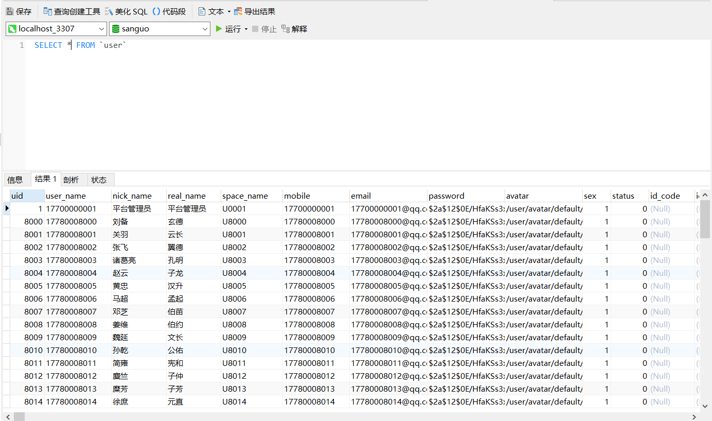

**2.查询用户表中所有数据，只显示 uid，user name， nick name,real name.sex 5列**

SELECT uid,user_name,nick_name,real_name,sex FROM `user`

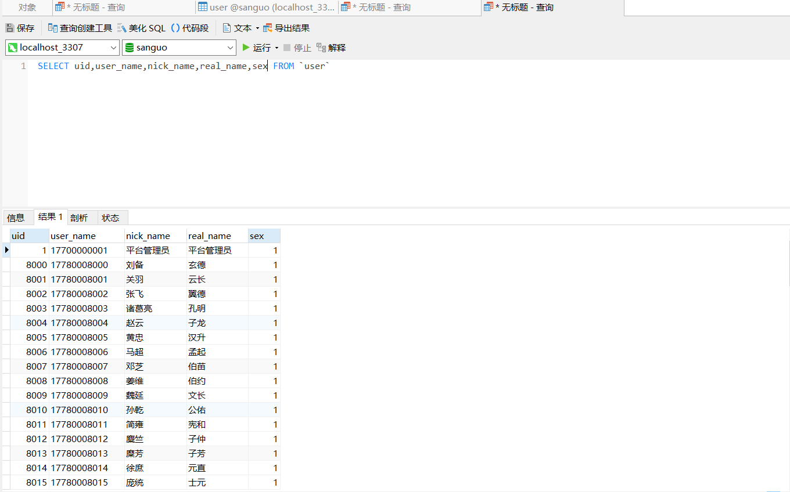

**3.采用汉字别名，查询用户表中所有数据，只显示用户编号、用户名、昵称、真实姓名、性别 5 列（as可以省略）**

SELECT uid 序号,user_name 编号,nick_name 姓名,real_name 字,sex 性别 FROM user

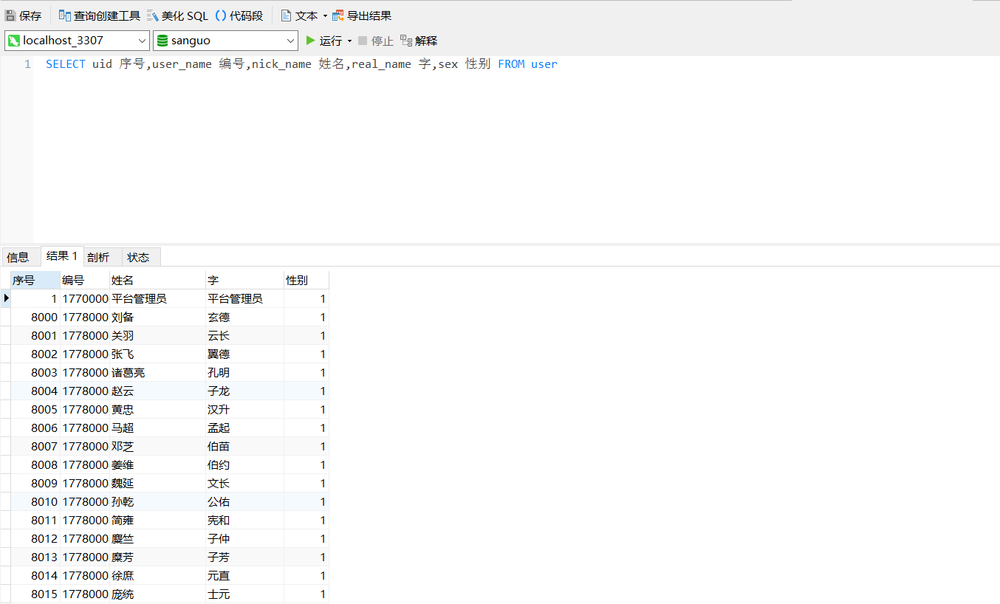

**4.上一个查询中，把性别转换为汉字，使用 case when 的用法**

select uid 序号,user_name 编号,nick_name 姓名,real_name 字,

case sex when 0 then '女' else '男' end 性别 from user;

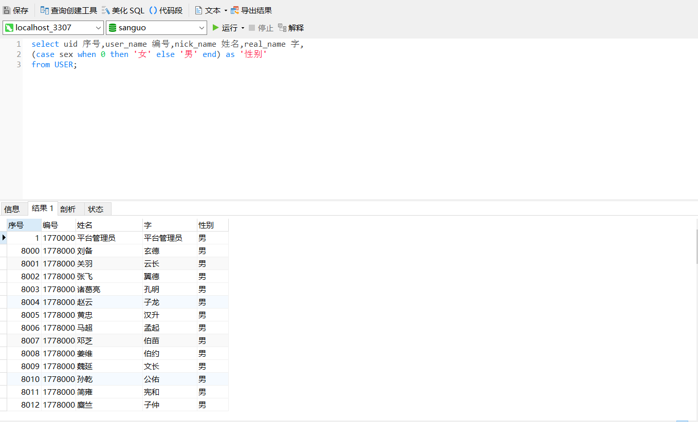

**5.上一个查询中，通过把姓和字提取出来，组合到一起。(学会使用 left,right,concat ) 函数使用**

SELECT uid 序号,user_name 编号,CONCAT(LEFT(nick_name,1),RIGHT(real_name,2)) 姓名,case sex when 0 then '女' else '男' end 性别 from user;

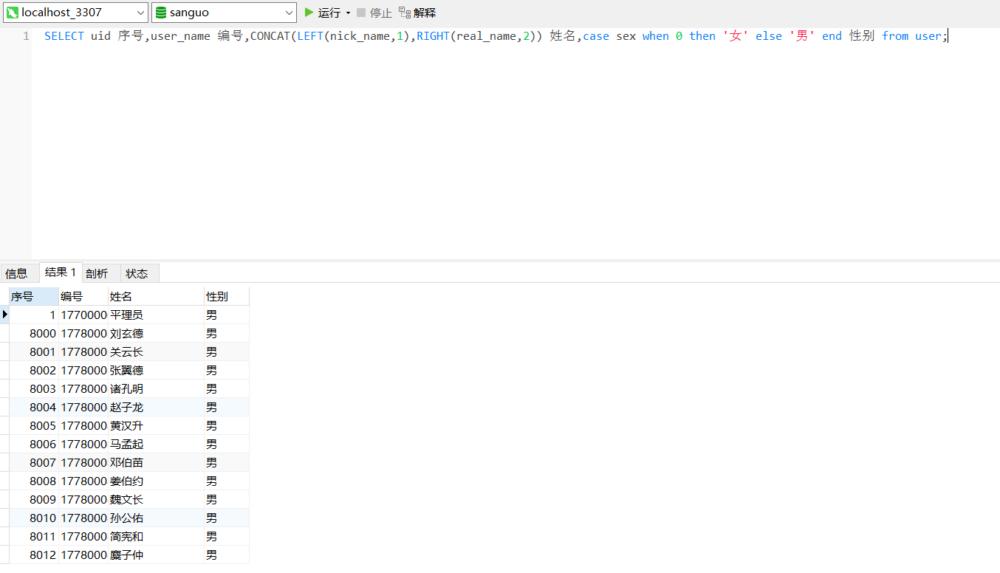

**限制查询**

**1.查询用户表中前面的 10 条记录**

select * from user limit 10

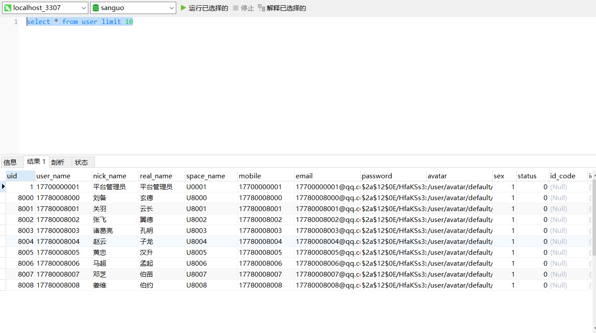

**2.查询用户表中5到10 条记录**

select * from user limit 5,5

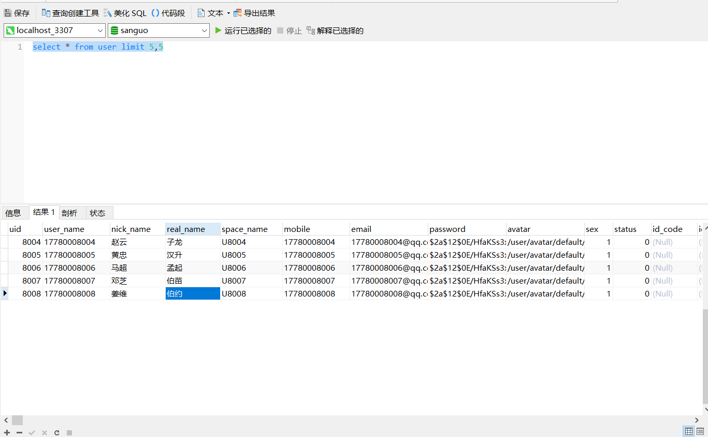

**条件查询**

**1.查询用户表中所有的男性**

select * from user where sex=1;

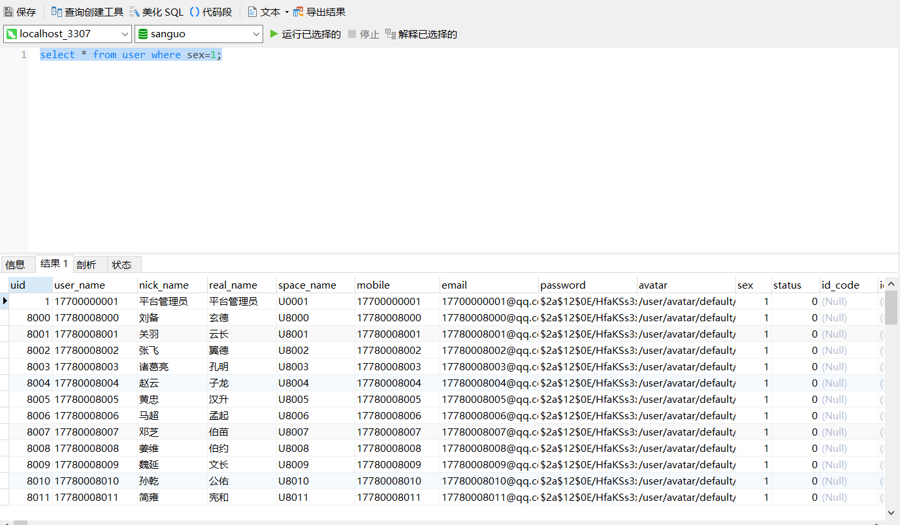

**2.采用汉字别名，查询表中所有数据，只显示用户编号，用户名，昵称，真实姓名，性别5列，并只查男性的前5条记录**

SELECT uid,user_name,nick_name,real_name,sex FROM user where sex=1 limit 5;

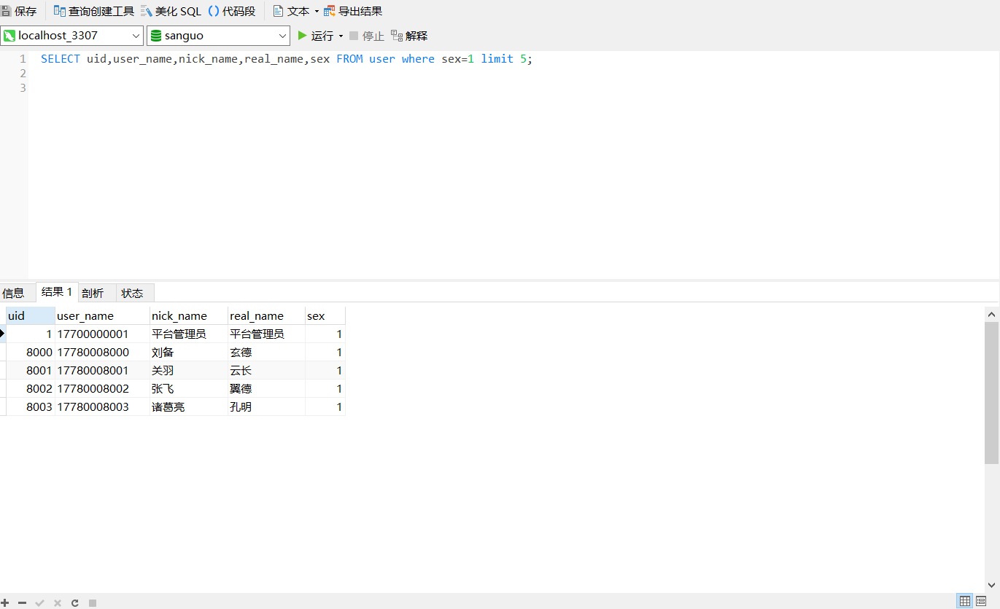

**分组查询**

**1.按照性别进行分组统计，统计每个性别的用户在表中的人数，分别使用简单case函数和case搜索函数形式**

select case sex when 0 then '女' else '男' end 性别,count(sex) 人数 from user GROUP BY sex

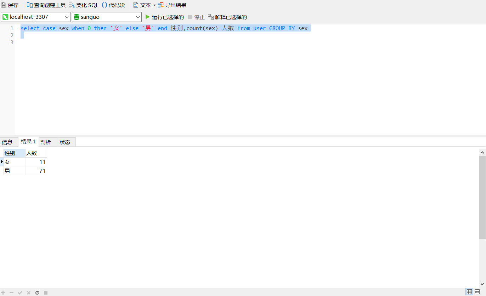

**2.查找某个姓氏中男性人数大于2的数据，比如刘姓，王姓**

select LEFT(nick_name,1) 姓氏,count(LEFT(nick_name,1)) 人数 from user where sex=1 GROUP BY LEFT(nick_name,1) HAVING count(LEFT(nick_name,1))>1

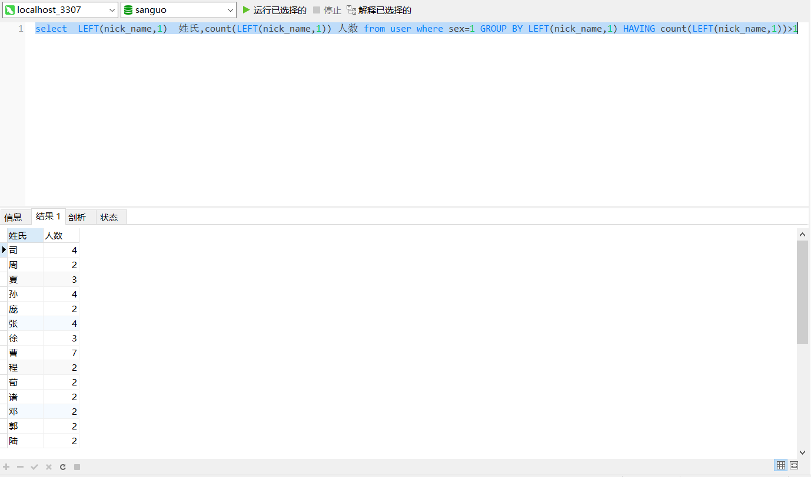