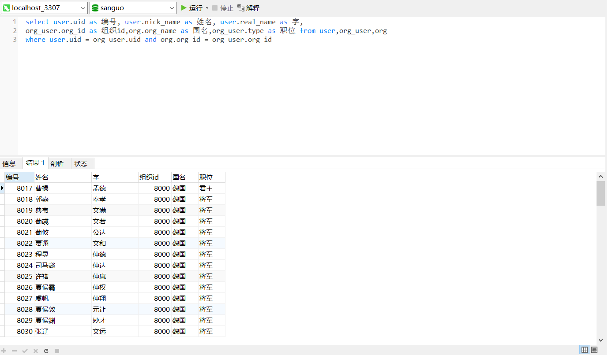
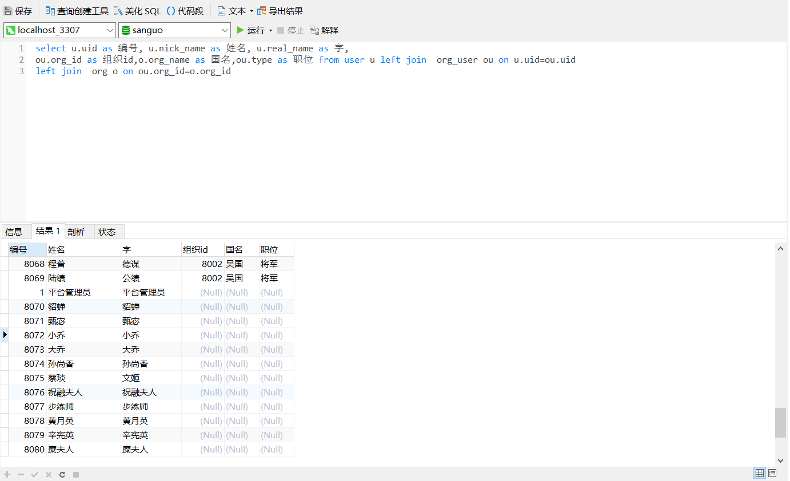
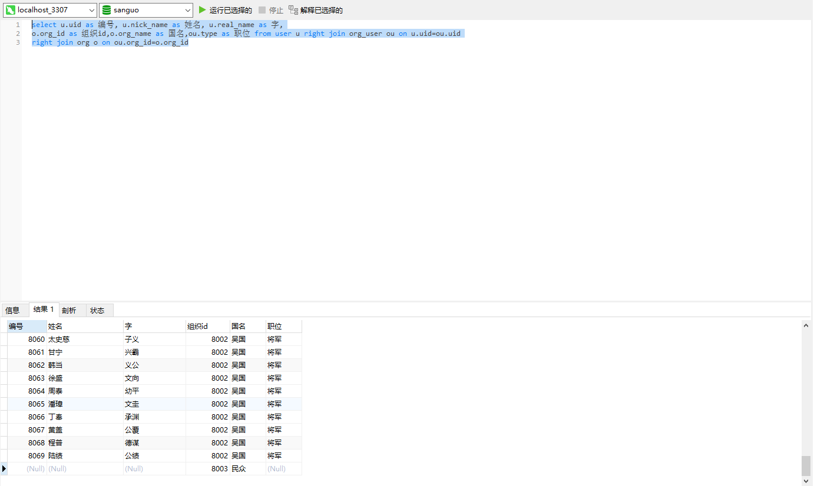
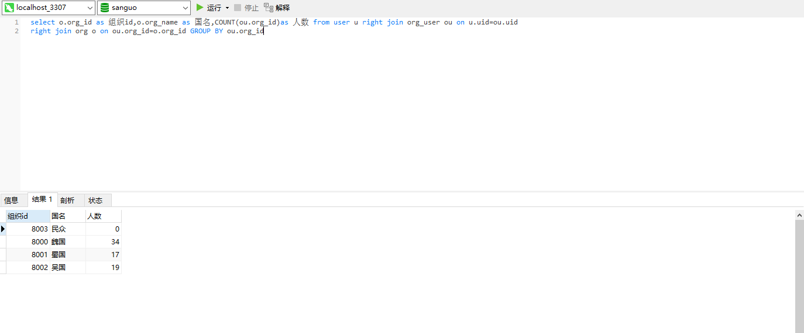
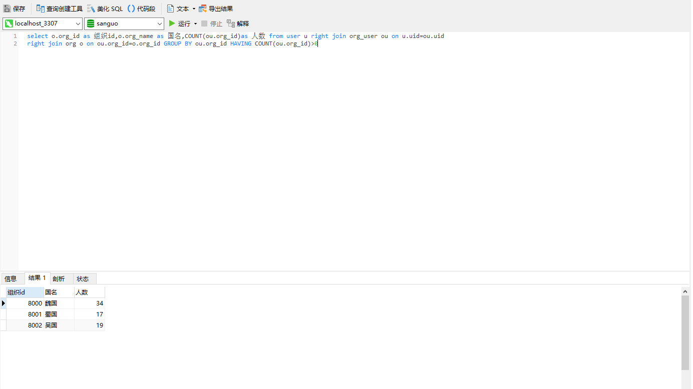
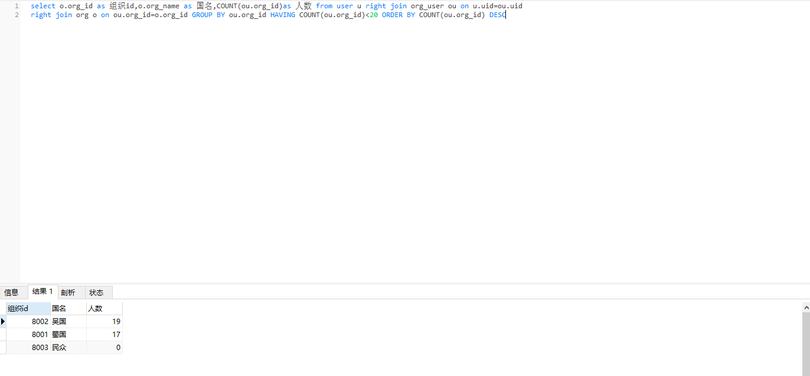

**内连接**
**1. 三表联查，查找用户的用户编号、昵称、真实姓名、组织编号、组织名称、还有身份类型。**

select user.uid as 编号, user.nick_name as 姓名, user.real_name as 字,

org.org_id as 组织id,org.org_name as 国名,org_user.type as 职位 from user,org_user,org

where user.uid = org_user.uid and org.org_id = org_user.org_id

**2.查找用户的用户编号、昵称、真实姓名、组织编号、组织名称、还有身份类型，把没有国家的用户数据也显示出来**。
select u.uid as 编号, u.nick_name as 姓名, u.real_name as 字,

o.org_id as 组织id,o.org_name as 国名,ou.type as 职位 from user u left join org_user ou on u.uid=ou.uid

left join org o on ou.org_id=o.org_id

select user.uid as 编号, user.nick_name as 姓名, user.real_name as 字,

org_user.org_id as 组织id,org.org_name as 国名,org_user.type as 职位 from user user left join org_user org_user on user.uid=org_user.uid

left join org org on org_user.org_id=org.org_id

**3.学习右连接，找用户的用户编号、昵称、真实姓名、组织编号、组织名称、还有身份类型，把还没有关联任何用户的国家显示出来**

select u.uid as 编号, u.nick_name as 姓名, u.real_name as 字,

o.org_id as 组织id,o.org_name as 国名,ou.type as 职位 from user u right join org_user ou on u.uid=ou.uid

right join org o on ou.org_id=o.org_id

**4.三表联查，按国家进行分组统计，注意不要漏掉了没有关联任何用户的国家**

select o.org_id as 组织id,o.org_name as 国名,COUNT(ou.org_id)as 人数 from user u right join org_user ou on u.uid=ou.uid

right join org o on ou.org_id=o.org_id GROUP BY ou.org_id

**5.三表联查，按国家进行分组统计，删选出国家人数小于等于0的国家**

select o.org_id as 组织id,o.org_name as 国名,COUNT(ou.org_id)as 人数 from user u right join org_user ou on u.uid=ou.uid

right join org o on ou.org_id=o.org_id GROUP BY ou.org_id HAVING COUNT(ou.org_id)>0

**6.三表联查，按国家进行分组统计，删选出国家人数大于20的国家，并按人数倒序排列**

select o.org_id as 组织id,o.org_name as 国名,COUNT(ou.org_id)as 人数 from user u right join org_user ou on u.uid=ou.uid

right join org o on ou.org_id=o.org_id GROUP BY ou.org_id HAVING COUNT(ou.org_id)<20 ORDER BY COUNT(ou.org_id) DESC

